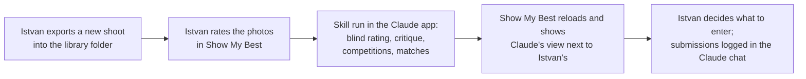

# Show My Best: requirements specification

| | |
|---|---|
| Version | 0.1, draft for review |
| Date | 2026-09-11 |
| Owner | Istvan Csenkey-Sinko |
| Based on | [discovery-notes.md](discovery-notes.md), decisions D1-D22 |

## 1. Purpose and scope

### 1.1 Product summary

Show My Best is a native macOS app for looking at, rating and learning from Istvan's
finished photos. It works together with the `photo-competition-curator` Claude skill, which
runs separately in the Claude app. The two never talk to each other directly: they share a
set of CSV files in the photo library folder.

Istvan rates his photos in the app first, without seeing Claude's opinion. The skill then
rates the same photos blind, without seeing Istvan's opinion, writes a critique of the
photos where the two views are most worth discussing, and matches photos to open
competitions. The app shows all of that once Istvan has formed his own view.

### 1.2 Goals

| # | Goal |
|---|------|
| G1 | Istvan forms his own judgement of each photo before seeing Claude's. |
| G2 | Istvan learns from an independent critic that argues, not one that agrees. |
| G3 | Culling a new shoot is fast and keyboard-driven. |
| G4 | Istvan sees at a glance which photos are worth entering in which competitions, and what he has entered. |
| G5 | Nothing the app does can damage the photos or lose data written by the skill. |

### 1.3 In scope for v1

- Opening a photo library folder and browsing its shoots and photos.
- Rating photos 1-5 in a gallery and in a full-screen review mode, including photos the
  skill has not catalogued yet.
- Showing Claude's rating, rationale and critique once Istvan has rated a photo.
- Showing competitions, photo-to-competition matches and submissions written by the skill.
- Saving Istvan's ratings to `catalogue.csv` safely while the skill may also be writing it.
- Changes to the `photo-competition-curator` skill needed to support the above (section 7).

### 1.4 Out of scope for v1

- Calling Claude, the Claude API or any network service from the app (D4).
- Mobile or iPad apps (D2).
- Editing photos, RAW files or negatives, or anything else DarkTable does.
- Editing any data other than Istvan's rating: titles, tags, status, competitions,
  submissions and results stay with the skill (D19).
- Replying to critiques (D17).
- Creating a new library from scratch: the skill creates `catalogue.csv` (D5).
- Sharing, exporting, publishing or uploading photos.
- Multiple users, accounts or sync between Macs.
- Geographic (GPS) browsing (D3).

## 2. Context

### 2.1 How the app and the skill work together

1. Istvan exports finished photos from DarkTable into a new shoot folder inside the library.
2. In Show My Best he culls and rates them. Photos the skill has not seen yet get a minimal
   row in `catalogue.csv` holding only his rating.
3. Later, in the Claude app, he asks the skill to catalogue the new work. The skill rates
   blind, then writes critiques, then searches competitions and writes matches.
4. Show My Best notices the changed files, reloads, and reveals Claude's rating, rationale
   and critique for every photo Istvan has rated.
5. Istvan picks competitions to enter. He tells Claude in chat what he submitted; the skill
   records it in `submissions.csv`, and the app shows it.

### 2.2 User

One user: Istvan, an experienced amateur photographer shooting digital (Canon EOS R8,
Canon EOS 6D, iPhone) and film, working on an Apple silicon iMac. Film negatives are scanned
with the Canon EOS R8 and developed in DarkTable; the finished image is what gets judged.

### 2.3 Terms

| Term | Meaning |
|------|---------|
| Library | The folder containing `catalogue.csv`, today `~/Pictures/6x6Stories/REAL_BEST`. |
| Shoot | A direct subfolder of the library holding the photos of one shoot, for example `R8_Rovinj_202606`. The name ends in `_YYYYMM`, the month the photos were taken. |
| Photo key | Shoot folder name plus filename. Unique within a library. |
| My rating | Istvan's rating, column `istvan_rating`. |
| Claude's rating | The skill's blind rating, column `claude_rating`. |
| Claude's evaluation | Claude's rating, rationale, critique, competition fit notes and per-photo match reasons. |
| Revealed | A photo is revealed when it has a rating from Istvan. Only then does the app show Claude's evaluation of it. |
| Critique | A short written review by Claude of a photo, column `claude_critique`. |
| Out-of-date critique | A critique written when Istvan's rating was different from what it is now. |
| Not catalogued | A photo on disk with no row in `catalogue.csv`. |
| Waiting for Claude | A photo with Istvan's rating but no Claude rating yet. |

### 2.4 Priorities

Requirements are marked **Must** (v1 is not done without it), **Should** (expected in v1,
can slip if costly) or **Could** (nice to have, later).

## 3. Independent opinions

The central rule of the product (D14-D17). It applies to every view.

| ID | Requirement | Priority |
|----|-------------|----------|
| IND-1 | For a photo Istvan has not rated, the app does not show any part of Claude's evaluation: Claude's rating, rationale, critique, competition fit notes or per-photo match reasons. | Must |
| IND-2 | Descriptive information is shown whether or not the photo is rated: title, subject, genre tags, date taken and date note, camera or format, medium, shoot and status. | Must |
| IND-3 | Filters, sorts, collections and badges based on Claude's rating only include photos Istvan has rated. Unrated photos are never included in or ordered by them, and the view shows how many unrated photos were left out. | Must |
| IND-4 | Where a competition has matched photos Istvan has not rated, the competitions view shows only their number ("2 matched photos you haven't rated yet"), not the photos themselves. | Must |
| IND-5 | Claude's evaluation of a photo appears as soon as Istvan's rating is saved. Clearing the rating hides it again. | Must |
| IND-6 | There is no setting or shortcut that shows Claude's evaluation of an unrated photo. | Must |
| IND-7 | A critique whose `critique_for_rating` differs from Istvan's current rating is marked out of date and shows the rating it was written for ("Written when you rated this 5"). | Must |

## 4. App functional requirements

### 4.1 Library and photos

| ID | Requirement | Priority |
|----|-------------|----------|
| LIB-1 | Istvan chooses the library folder once; the app remembers it across launches and offers to change it from the menu. | Must |
| LIB-2 | If Istvan chooses a shoot folder rather than the library, the app opens the library above it with that shoot selected (D3). | Must |
| LIB-3 | If neither the chosen folder nor its parent contains `catalogue.csv`, the app explains that the skill needs to catalogue the folder first. It does not create the file (D5). | Must |
| LIB-4 | A shoot is a direct subfolder of the library whose name does not start with `_` or `.`. | Must |
| LIB-5 | A photo is a file directly inside a shoot folder, with extension `jpg`, `jpeg`, `png`, `heic`, `tif` or `tiff` in any letter case, whose name does not start with `.`. | Must |
| LIB-6 | Photos are identified by photo key (shoot folder name + filename), matched exactly against `source_folder` and `filename` in `catalogue.csv`. | Must |
| LIB-7 | Photos on disk without a catalogue row are shown and marked "Not catalogued". They can be rated (RAT-3). | Must |
| LIB-8 | Catalogue rows whose photo file is missing are listed under "Missing files". The app never removes these rows. | Should |
| LIB-9 | Everything else in the library is ignored, including `_meta*.csv`, `_contact_sheets/` and `.DS_Store`. | Must |

### 4.2 Gallery

| ID | Requirement | Priority |
|----|-------------|----------|
| GAL-1 | The gallery shows a thumbnail grid of the photos in the current scope: the whole library, one shoot, or a collection. | Must |
| GAL-2 | A sidebar lists the shoots with photo counts, and these collections: All photos; Not rated by me; My best (my rating 4-5); Claude's picks (Claude's rating 4-5); Disagreements (ratings differ by 2 or more); Critiques; Waiting for Claude; Not catalogued. Collections based on Claude's rating follow IND-3. | Must |
| GAL-3 | Filters, combinable: my rating (including unrated), Claude's rating (IND-3), genre tag, medium (digital or film), camera or format, status. | Must |
| GAL-4 | Sort by: date taken; shoot then filename; my rating; Claude's rating (IND-3). | Must |
| GAL-5 | Each thumbnail shows my rating. For revealed photos it also shows Claude's rating and a marker when a critique exists, with a different marker when the critique is out of date. | Must |
| GAL-6 | Thumbnails show "Not catalogued" and "Waiting for Claude" badges. | Should |
| GAL-7 | Thumbnail size is adjustable. | Should |
| GAL-8 | The selected photo can be rated from the grid with keys 1-5, and cleared with 0. | Must |
| GAL-9 | With several photos selected, keys 1-5 and 0 apply to all of them. | Should |
| GAL-10 | Double-click or Return opens the photo detail. | Must |

### 4.3 Review mode

| ID | Requirement | Priority |
|----|-------------|----------|
| CUL-1 | Review mode shows the photos of the current gallery scope one at a time, full screen, in the gallery's sort order. | Must |
| CUL-2 | Review mode can be started from the toolbar, the menu and a shortcut. Starting it from a shoot offers "Not rated by me" in that shoot as the scope. | Must |
| CUL-3 | Keys: 1-5 rate; 0 or Delete clears the rating; Left and Right arrows move to the previous and next photo; Esc leaves review mode. | Must |
| CUL-4 | The photo fills the screen on a neutral background. A minimal overlay shows filename, shoot, my rating and position ("12 of 48"), and can be hidden. | Must |
| CUL-5 | A setting controls what happens after rating: move to the next photo (default) or stay and show Claude's view. | Must |
| CUL-6 | Key I toggles an info panel with the photo's descriptive information, and Claude's evaluation if the photo is revealed. | Must |
| CUL-7 | The list of photos is fixed when review mode starts. Rating a photo out of the scope (for example out of "Not rated by me") does not remove it until Istvan leaves review mode. | Must |
| CUL-8 | Key Z toggles between fit-to-screen and 100% zoom; at 100% the photo can be panned. | Should |
| CUL-9 | Key F toggles a filmstrip of thumbnails along the bottom. | Should |
| CUL-10 | Cmd-Z undoes the last rating change, and the undo is saved like any rating. | Should |
| CUL-11 | Key C compares the current photo with the next one side by side, for choosing between near-duplicates. | Could |

### 4.4 Photo detail

| ID | Requirement | Priority |
|----|-------------|----------|
| DET-1 | The detail view shows the photo large, with title, subject, shoot, date taken and date note, camera or format, medium, genre tags and status. | Must |
| DET-2 | My rating and Claude's rating are shown side by side. My rating can be changed here. Claude's follows IND-1. | Must |
| DET-3 | Claude's rationale and critique are shown for revealed photos, the critique clearly labelled and marked when out of date (IND-7). | Must |
| DET-4 | For revealed photos, the competitions this photo is matched to are listed with deadline, category, primary or alternate, and the reason, plus the competition fit notes. | Must |
| DET-5 | Submissions that include this photo are listed with competition and result. | Must |
| DET-6 | Camera settings read from the file are shown: dimensions, lens, focal length, aperture, shutter speed, ISO. | Should |
| DET-7 | "Show in Finder" reveals the photo file. | Should |
| DET-8 | "Open with" opens the photo file in another app. | Could |

### 4.5 Rating and saving

These requirements implement D12, D13 and the write rules in the discovery notes.

| ID | Requirement | Priority |
|----|-------------|----------|
| RAT-1 | Istvan's rating is a whole number 1-5 or empty. It is saved in the `istvan_rating` column of the photo's row in `catalogue.csv`. | Must |
| RAT-2 | A rating change is saved to disk within 1 second. | Must |
| RAT-3 | Rating a photo that has no row appends one row with `filename`, `source_folder`, `istvan_rating` and `status` = `available`, all other columns empty. Clearing the rating later leaves the row in place with an empty rating. | Must |
| RAT-4 | Before every save, the app reads `catalogue.csv` from disk again and applies its pending changes to that fresh copy, never to an older copy held in memory. | Must |
| RAT-5 | The app changes only `istvan_rating` cells and appends rows. It never changes other cells, deletes rows, or adds, removes or reorders columns or rows. | Must |
| RAT-6 | Rows the app did not change are written back byte for byte as they were, including quoting and line endings. Appended rows use the file's existing line ending. | Must |
| RAT-7 | The app writes to a temporary file in the library folder and then replaces `catalogue.csv` with it in one step, so no reader ever sees a half-written file. | Must |
| RAT-8 | If `catalogue.csv` cannot be parsed, or lacks a required column (section 6.2), the app does not write. It keeps the changes pending, shows a warning, and tries again when the file changes. | Must |
| RAT-9 | Pending changes survive quitting or a crash and are applied at the next launch. | Must |
| RAT-10 | Before its first write each day, the app copies `catalogue.csv` to a backups folder in its Application Support folder, keeping the 30 most recent copies. A menu item shows the backups in Finder. | Must |
| RAT-11 | The app keeps a log of every rating change it saves: time, photo key, previous value, new value. The log is stored in its Application Support folder. | Must |
| RAT-12 | When the app reloads `catalogue.csv` and finds that a rating it saved in the last 7 days has gone back to its previous value, it restores the saved value and tells Istvan which photos were restored. | Must |
| RAT-13 | The app writes no file in the library other than `catalogue.csv` and its own temporary file. | Must |

### 4.6 Competitions

| ID | Requirement | Priority |
|----|-------------|----------|
| CMP-1 | The competitions view lists the competitions in `competitions.csv`, soonest deadline first. | Must |
| CMP-2 | Each competition shows a status worked out from its dates: Not open yet, Open, Closing soon (deadline within 7 days), Closed. Closed competitions are hidden unless Istvan chooses to show them. | Must |
| CMP-3 | Each competition shows name, organizer, categories, deadline with days left, entry fee, prize, tier, the skill's call (Enter, Skip or Worth it regardless) with its reasoning, eligibility, capture date rule, previously-unpublished rule, and rights flag with notes. | Must |
| CMP-4 | "Rights grab" and "Caution" flags are prominent, not buried in text. | Must |
| CMP-5 | Matched photos are shown as thumbnails with primary or alternate role, category, both ratings and the reason, following IND-4 for photos Istvan has not rated. A thumbnail opens the photo detail. | Must |
| CMP-6 | The competition's website opens in the default browser when Istvan clicks its link. This is the only way the app causes network access (NFR-2). | Must |
| CMP-7 | A competition whose `last_checked` date is more than 14 days old shows a notice that its details may have changed and should be re-checked with Claude. | Should |
| CMP-8 | If `competitions.csv` does not exist, the view explains that the skill creates it when it searches for competitions. | Must |

### 4.7 Submissions

| ID | Requirement | Priority |
|----|-------------|----------|
| SUB-1 | The submissions view lists the entries in `submissions.csv`, newest first, with date, competition, category, photos, fee, the skill's call, result and notes. | Must |
| SUB-2 | Results are shown as clear labels: Pending, Won, Placed, No award. | Must |
| SUB-3 | Photo thumbnails in a submission open the photo detail. | Must |
| SUB-4 | A submission links to its competition in the competitions view. | Should |
| SUB-5 | A summary shows number of entries, fees paid per currency, and results by type. | Should |
| SUB-6 | If `submissions.csv` does not exist or has no entries, the view says so. | Must |

### 4.8 Reloading and errors

| ID | Requirement | Priority |
|----|-------------|----------|
| SYN-1 | The app watches the library for changes to its CSV files and shoot folders, and reloads within 2 seconds of a change made outside the app. Selection, scroll position and review position are kept. | Must |
| SYN-2 | If a file fails to parse right after a change, the app waits briefly and tries again before reporting an error, in case another program was still writing it. | Must |
| SYN-3 | When a file cannot be parsed, the app keeps showing the last good data and shows a non-blocking message naming the file and the line. | Must |
| SYN-4 | Missing `competitions.csv`, `competition_matches.csv` or `submissions.csv` is not an error. | Must |
| SYN-5 | The app works with `catalogue.csv` as the skill writes it today, before the skill changes in section 7. Features that need missing columns are hidden (for example critiques, the medium filter), and dates that are not in the new format are shown as text and sorted last. | Must |
| SYN-6 | Cmd-R reloads all files. | Should |

## 5. Non-functional requirements

| ID | Requirement | Priority |
|----|-------------|----------|
| NFR-1 | Native macOS app written in Swift and SwiftUI, running on Apple silicon. The minimum macOS version is set in the design document (OI-1). | Must |
| NFR-2 | The app makes no network connections: no Claude, no analytics, no crash reporting, no update checks. The only exception is opening a competition link in the browser when Istvan clicks it. | Must |
| NFR-3 | The app never modifies, moves, renames or deletes photo files or folders. | Must |
| NFR-4 | Photos are shown colour-managed, using their embedded colour profile, and in the orientation recorded in the file. | Must |
| NFR-5 | With a library of 5,000 photos, the app stays responsive while thumbnails are generated in the background. | Must |
| NFR-6 | With thumbnails already cached, the gallery for a 5,000-photo library appears within 2 seconds of launch and scrolls smoothly. | Should |
| NFR-7 | In review mode, the next photo appears within 150 ms; neighbouring photos are prepared in advance. | Should |
| NFR-8 | Thumbnails are cached outside the library, in the user's Caches folder, and regenerated when a photo file's modification date or size changes. | Must |
| NFR-9 | Photos are shown on a neutral grey background in both light and dark appearance; the rest of the interface follows the system appearance. | Should |
| NFR-10 | Every action can be done with the keyboard. | Must |
| NFR-11 | Ratings, flags and markers have VoiceOver labels. | Should |
| NFR-12 | Text in all files is read and written as UTF-8. Hungarian characters (á, é, ö, ő, ü, ű) survive a read and write unchanged. | Must |
| NFR-13 | The interface is in English. | Must |
| NFR-14 | One user on one Mac. No accounts, no sign-in. | Must |

## 6. Data contract

The files below are the only interface between the app and the skill. Both must follow this
section exactly.

### 6.1 Rules for all files

| ID | Rule |
|----|------|
| FMT-1 | Standard CSV (RFC 4180): comma-separated, one header row, fields that contain a comma, double quote or line break are enclosed in double quotes, and a double quote inside a field is written twice. |
| FMT-2 | UTF-8 without byte order mark. |
| FMT-3 | Lines end with CRLF, as `catalogue.csv` does today. Readers also accept LF. |
| FMT-4 | Columns are found by header name, not position. New columns are added at the end. |
| FMT-5 | Every writer keeps columns it does not know about, with their values. |
| FMT-6 | Dates use ISO 8601: `YYYY-MM-DD`, or `YYYY-MM-DDTHH:MM:SS` in local time without a time zone, or `YYYY-MM` or `YYYY` when only that much is known. |
| FMT-7 | A photo reference is `source_folder/filename`, for example `R8_Rovinj_202606/IMG_0412.JPG`. Lists of references are separated by `;` without spaces. |
| FMT-8 | An empty field means unknown or not set. |
| FMT-9 | Every writer replaces a file in one step (temporary file, then rename). |
| FMT-10 | A file missing a required column is treated as unreadable for anything that needs that column. |

### 6.2 `catalogue.csv`

One row per photo. Photo key (`source_folder` + `filename`) is unique.

| Column | Content | Written by | Required | Change |
|--------|---------|------------|----------|--------|
| `filename` | Filename exactly as on disk. | Skill; app for rows it adds | Yes | |
| `source_folder` | Shoot folder name. | Skill; app for rows it adds | Yes | |
| `title` | Short descriptive title. | Skill | | |
| `date_taken` | When the photo was taken, in FMT-6 format. For film: when the film was exposed, not when it was scanned. | Skill | | Format changes |
| `date_note` | Free-text note about the date, for example `year corrected: 6D clock was wrong`. | Skill | | New |
| `medium` | `digital` or `film`. Film means a negative scan, recognised by the shoot folder prefix (SKL-22). | Skill | | New |
| `camera_or_format` | Digital: camera model from the photo's EXIF data. Film: `SL35 negative scan` or `6x6 negative scan`. | Skill | | Film values change |
| `genre_tags` | Tags separated by `, `. | Skill | | |
| `subject` | Short description of what is in the photo. | Skill | | |
| `istvan_rating` | `1`-`5` or empty. | App only; the skill keeps it unchanged | Yes | |
| `claude_rating` | `1`-`5`, or empty when Claude has not rated the photo yet. | Skill | Yes | |
| `claude_rationale` | One sentence explaining Claude's rating. | Skill | | |
| `claude_critique` | Critique, 2-4 sentences, at most 600 characters. | Skill | | New |
| `critique_for_rating` | Istvan's rating (`1`-`5`) at the time the critique was written. | Skill | | New |
| `competition_fit_notes` | Readable summary of the photo's competition matches. | Skill | | |
| `status` | `available`, `submitted`, `published` or `retired`. | Skill; app writes `available` on rows it adds | Yes | |
| `last_updated` | Date (`YYYY-MM-DD`) the skill last changed the row. | Skill | | |

### 6.3 `competitions.csv` (new)

One row per competition the skill has researched.

| Column | Content | Required |
|--------|---------|----------|
| `competition_id` | Stable identifier: lowercase words and digits joined by hyphens, for example `cewe-photo-award-2026-27`. Unique. | Yes |
| `name` | Competition name. | Yes |
| `organizer` | Who runs it. | |
| `url` | Official page. | Yes |
| `categories` | Categories or themes relevant to Istvan, separated by `;`. | |
| `opens` | Opening date, empty if already open. | |
| `deadline` | Closing date, `YYYY-MM-DD`. | Yes |
| `deadline_note` | Extra detail such as time and time zone. | |
| `entry_fee` | Fee as the organizer states it, for example `Free` or `EUR 8 per image`. | |
| `fee_amount` | Number; `0` when free. | |
| `fee_currency` | ISO 4217 code such as `EUR` or `HUF`; empty when free. | |
| `tier` | `local`, `national` or `international`. | |
| `eligibility` | Who may enter. | |
| `capture_date_rule` | Rule on when photos must have been taken; empty when none. | |
| `previously_unpublished` | `yes`, `no` or `unknown`. | |
| `prize` | What winners get. | |
| `rights_flag` | `ok`, `caution` or `rights-grab`. | Yes |
| `rights_notes` | What the organizer claims over entries. | |
| `recommendation_call` | `enter`, `skip` or `worth-it-regardless`. | Yes |
| `reasoning` | Why the skill made this call. About the competition only, never about the quality of specific photos (SKL-16). | |
| `last_checked` | Date the skill last verified the details online. | Yes |

### 6.4 `competition_matches.csv` (new)

One row per photo matched to a competition. `competition_id` + `source_folder` + `filename`
is unique.

| Column | Content | Required |
|--------|---------|----------|
| `competition_id` | Refers to `competitions.csv`. | Yes |
| `source_folder` | Shoot folder of the photo. | Yes |
| `filename` | Filename of the photo. | Yes |
| `category` | Category to enter the photo in. | |
| `role` | `primary` or `alternate`. | Yes |
| `reason` | Why this photo suits this competition, naming both ratings and, if they differ by 2 or more, the risk. | |
| `matched_on` | Date the match was made. | |

### 6.5 `submissions.csv`

One row per entry Istvan confirmed he made. The file has no entries today, so the format can
change without migrating data.

| Column | Content | Required | Change |
|--------|---------|----------|--------|
| `date_submitted` | Date of the entry. | Yes | |
| `competition_id` | Refers to `competitions.csv`; empty if the competition is not in that file. | | New |
| `competition_name` | Competition name. | Yes | |
| `entry_fee` | Fee paid, as stated. | | |
| `deadline` | Competition deadline. | | |
| `photos_submitted` | Photo references (FMT-7). | Yes | Format changes |
| `category` | Category entered. | | |
| `recommendation_call` | The skill's call at the time: `enter`, `skip` or `worth-it-regardless`. | | |
| `result` | `pending`, `won`, `placed` or `no-award`. | Yes | Values fixed |
| `notes` | Free text. | | |

## 7. Skill change requirements

Changes to the `photo-competition-curator` skill. The app does not depend on them to start
(SYN-5), but the independent-opinion and critique features do.

### 7.1 Files and writing

| ID | Requirement | Priority |
|----|-------------|----------|
| SKL-1 | Folders whose names start with `_` or `.` are never treated as shoots. | Must |
| SKL-2 | The skill reads `catalogue.csv` again immediately before each write and applies its changes to that fresh copy, never writing back a copy read earlier in the run. | Must |
| SKL-3 | The skill never changes `istvan_rating`. The value always comes from the file on disk. | Must |
| SKL-4 | The skill writes every file through a temporary file and a rename (FMT-9). | Must |
| SKL-5 | The skill keeps existing row order and unknown columns, appends new rows and columns at the end, and never deletes catalogue rows (it sets `status` to `retired` instead). | Must |
| SKL-6 | When a row for a photo key already exists, for example one the app added, the skill fills it in rather than adding a second row. | Must |
| SKL-7 | Every file the skill writes follows section 6. | Must |

### 7.2 Blind rating

| ID | Requirement | Priority |
|----|-------------|----------|
| SKL-8 | Before rating, the skill gets the list of photos that need a Claude rating (no row, or empty `claude_rating`) from a script whose output leaves out `istvan_rating`, `claude_critique` and `critique_for_rating`. Until every rating in the run is saved, the skill does not read `catalogue.csv` in any way that would show it Istvan's ratings. | Must |
| SKL-9 | The skill rates against a rubric written in the skill: impact, distinctiveness of moment or subject, composition, light, technical execution, originality and story. Scale: 1 = not competition material (technical problems or no clear subject); 2 = competent, pleasant, nothing a jury would stop for; 3 = solid, with one clear strength, unlikely to stand out; 4 = strong, several strengths working together, a real contender at local or national level; 5 = distinctive and memorable, could place in a major competition, rare. Negative scans are rated as the finished, developed image by the same standards: scanning and development are part of making the image, neither a flaw nor a bonus in themselves. | Must |
| SKL-10 | The skill saves `claude_rating` and `claude_rationale` for all photos in the run before it starts writing any critique. | Must |
| SKL-11 | The skill never changes `claude_rating` because of Istvan's rating. The only exception is when Istvan explicitly asks for a fresh blind re-rating of named photos, which follows SKL-8 to SKL-10. | Must |

### 7.3 Critique

| ID | Requirement | Priority |
|----|-------------|----------|
| SKL-12 | The skill writes a critique for every photo where Istvan's rating is 4 or 5, or where Claude's rating is 4 or 5 and Istvan's is 1 or 2, if the photo has no critique or its critique is out of date (`critique_for_rating` differs from `istvan_rating`). | Must |
| SKL-13 | A critique is addressed to Istvan and argues from what is in the frame. When Claude agrees, it says what a jury could still hold against the photo. When Claude rates lower, it says what weakens the photo, asks what carries it and gives Claude's own answer. In the reverse case, it says why the photo may have been dismissed too quickly. It separates personal value from value to a jury. No flattery, no hedging. 2-4 sentences, at most 600 characters. | Must |
| SKL-14 | The skill sets `critique_for_rating` to Istvan's rating when it writes a critique. When a photo no longer qualifies for a critique, its old critique is left in place. | Must |

### 7.4 Competitions and submissions

| ID | Requirement | Priority |
|----|-------------|----------|
| SKL-15 | Every competition the skill researches is saved to `competitions.csv`, updating an existing row with the same `competition_id` and setting `last_checked`. Closed competitions are kept. | Must |
| SKL-16 | The `reasoning` in `competitions.csv` is about the competition (fee, odds, prestige, rights). Judgements about specific photos go only in `competition_matches.csv`, so the app can hide them for unrated photos. | Must |
| SKL-17 | A photo is a candidate for a competition if either rating is 4 or 5. Matches are written to `competition_matches.csv` with category, role and reason; the reason names both ratings and, when they differ by 2 or more, the risk. | Must |
| SKL-18 | When the skill re-matches a competition, it replaces that competition's rows in `competition_matches.csv`. | Should |
| SKL-19 | `competition_fit_notes` stays as a readable summary consistent with `competition_matches.csv`. | Should |
| SKL-20 | Submissions are logged in the section 6.5 format, only after Istvan confirms he made them. | Must |

### 7.5 Data quality

| ID | Requirement | Priority |
|----|-------------|----------|
| SKL-21 | `date_taken` is written in FMT-6 format, with any explanation in `date_note`. The `_YYYYMM` at the end of the shoot folder name is the month the photos were taken; for film, the month the roll was shot. A digital photo's EXIF date is used only when it falls in that month; otherwise `date_taken` is `YYYY-MM` from the folder name and the EXIF date goes into `date_note`. Film rows always use the folder month, because their EXIF date is the scan date. If a new shoot folder name has no `_YYYYMM` ending, the skill asks Istvan for the month. | Must |
| SKL-22 | `medium` is set for every row from the shoot folder prefix: shoots starting with `SL35_` or `6X6_` (any letter case) are negative scans made with the Canon EOS R8, so `medium` is `film` and `camera_or_format` is `SL35 negative scan` or `6x6 negative scan`; the EXIF camera is ignored for them. All other shoots are `digital`, with `camera_or_format` from each photo's EXIF data, since a shoot folder can mix cameras. | Must |

## 8. Migration of existing data

A one-time skill run that brings today's files in line with section 6.

| ID | Requirement | Priority |
|----|-------------|----------|
| MIG-1 | Before changing anything, the skill copies all CSV files into a `_backups/` folder in the library, with the date in the filename. | Must |
| MIG-2 | Adds the columns `date_note`, `medium`, `claude_critique` and `critique_for_rating` to `catalogue.csv`. | Must |
| MIG-3 | Converts `date_taken` on all rows as in SKL-21, moving explanations into `date_note`. Examples: `IMG_9738.JPG` in `R8_Budapest_202606` with EXIF `2026:01:22 17:20:57` becomes `2026-06` with note `EXIF date 2026-01-22 17:20:57, camera clock wrong`; `IMG_0998.jpg` in `SL35_Szeged_202607` becomes `2026-07` with note `scanned 2026-09-10`. Exception: the 4 Canon EOS 700D photos in `6D_Szeged_202605` are dated `2026-06-02` and marked "camera clock correct", which is outside the folder month; the skill asks Istvan which date is right instead of applying the rule. | Must |
| MIG-4 | Sets `medium` and `camera_or_format` as in SKL-22: today that makes the 88 photos in the four `SL35_` shoots `film` and the rest `digital`. Anything uncertain is asked, not guessed. | Must |
| MIG-5 | Builds `competitions.csv` and `competition_matches.csv` from the 60 rows that have `competition_fit_notes`, re-checking each competition online first. Competitions that cannot be verified are left out and listed for Istvan. | Must |
| MIG-6 | Replaces the `submissions.csv` header with the section 6.5 format. | Must |
| MIG-7 | Does not change `istvan_rating` or `claude_rating`. No critiques are written during migration. | Must |
| MIG-8 | Afterwards checks that the row count (329 today) and every photo key are unchanged and every `date_taken` is in FMT-6 format, and reports the result. | Should |

## 9. Acceptance scenarios

| ID | Scenario | Checks |
|----|----------|--------|
| AC-1 | **Rate a new shoot before Claude.** A new shoot folder has 20 photos with no catalogue rows. Istvan rates 12 of them in review mode. | `catalogue.csv` has 12 new rows at the end with filename, shoot, rating and `available`. All other rows are byte-identical. No Claude information is shown for these photos. RAT-3, RAT-6, IND-1. |
| AC-2 | **Nothing leaks before rating.** A photo has Claude's rating 5, a rationale, fit notes and a competition match, and no rating from Istvan. | It is not in Claude's picks, Disagreements or Critiques; it has no Claude badge; its detail shows no Claude rating, rationale, critique or fit notes; its competition shows it only as a count. IND-1 to IND-4. |
| AC-3 | **Reveal.** Istvan rates that photo 5 in the detail view. | Within 1 second the rating is in the file and Claude's rating and rationale appear. RAT-2, IND-5. |
| AC-4 | **Old skill overwrites a rating.** A skill run reads the catalogue, Istvan rates photo X, then the run writes the whole file from its earlier copy. | After the app reloads, X's rating is restored within 2 seconds and Istvan is told. RAT-12, SYN-1. |
| AC-5 | **Updated skill keeps a rating.** Same as AC-4 with the updated skill. | X's rating is still in the file after the run without any restore. SKL-2, SKL-3. |
| AC-6 | **Out-of-date critique.** A photo has a critique with `critique_for_rating` 5. Istvan changes his rating to 3. | The critique is marked "Written when you rated this 5". After the next skill run it is still there and still marked, because the photo no longer qualifies. IND-7, SKL-14. |
| AC-7 | **Broken file.** `catalogue.csv` has an unbalanced quote on line 120. Istvan rates a photo. | Nothing is written; a message names line 120; the last good data stays on screen. After the file is fixed, the rating is saved. RAT-8, SYN-3. |
| AC-8 | **Today's file.** The app opens the library as it is today (13 columns). | 329 photos in 13 shoots; dates shown as text; no critique features; rating works. SYN-5. |
| AC-9 | **Same filename in two shoots.** `IMG_2216.JPG` exists in two shoots. Istvan rates one. | Only that shoot's row changes. LIB-6. |
| AC-10 | **Blind skill run.** Photos with Istvan's ratings and no Claude rating are catalogued by the updated skill. | The run shows the photo list came from the script without Istvan's ratings, and all Claude ratings were saved before the first critique. SKL-8, SKL-10. Checked by reading the run. |
| AC-11 | **No network.** The app is launched, browsed, and used to rate and review under a network monitor. | No connections are made. NFR-2. |
| AC-12 | **Hungarian text.** A row has title `Zebegényi hídnál` and the app saves a rating on another row. | The title is unchanged in the file. NFR-12, RAT-6. |

## 10. Open items

| ID | Item | Proposal |
|----|------|----------|
| OI-1 | Minimum macOS version. | Decide in the design document, based on the version on Istvan's iMac and the SwiftUI features needed. |
| OI-2 | How film rows are labelled. | *Resolved:* `SL35_` and `6X6_` shoots are negative scans made with the Canon EOS R8 and developed in DarkTable (SKL-22). |
| OI-3 | Default behaviour after rating in review mode. | Move to the next photo (CUL-5); revisit after first use. |
| OI-4 | Titles are written by Claude and could hint at its opinion. | Show them before rating, since they describe rather than judge (IND-2). Istvan to confirm. |
| OI-5 | How the app is built, signed and installed on the iMac (not through the App Store). | Decide in the design document. |
| OI-6 | Which date counts as "date taken", given unreliable EXIF dates (film scans carry scan dates; the R8 clock is months off). | *Resolved:* the folder's `_YYYYMM` is the month taken, for film the month the roll was shot (SKL-21). |

## 11. Traceability

| Decision | Covered by |
|----------|------------|
| D1 Native macOS app | NFR-1 |
| D2 No mobile in v1 | 1.4 |
| D3 Location is a folder | LIB-1, LIB-2, 1.4 |
| D4 App does not call Claude | NFR-2, CMP-6, 1.4 |
| D5 Skill creates the data files | LIB-3, RAT-13, 1.4 |
| D6 Istvan rates in the app | RAT-1 to RAT-13 |
| D7 Review mode | CUL-1 to CUL-11 |
| D8 Gallery, detail, competitions, submissions | 4.2, 4.4, 4.6, 4.7 |
| D9 `competitions.csv` | 6.3, 6.4, SKL-15 to SKL-19, MIG-5 |
| D10 Reload on external change | SYN-1 to SYN-3 |
| D11 App makes its own thumbnails | NFR-8 |
| D12 Ratings in `catalogue.csv` | RAT-1, RAT-4 to RAT-12, SKL-2 to SKL-5 |
| D13 Rate first | LIB-7, RAT-3, SKL-6, AC-1 |
| D14 Istvan's judgement first | IND-1 to IND-6, CUL-6, DET-2 to DET-4, AC-2, AC-3 |
| D15 Claude rates blind | SKL-8 to SKL-11, AC-10 |
| D16 Critic partner | SKL-12, SKL-13 |
| D17 One-way critique | IND-7, SKL-11, SKL-14, 1.4, AC-6 |
| D18 Istvan's rating counts in matching | SKL-17, CMP-5 |
| D19 App writes only ratings | RAT-5, RAT-13, 1.4 |
| D20 Reverse-case critique | SKL-12, SKL-13 |
| D21 Film scans by folder prefix, judged as the final image | SKL-9, SKL-22, MIG-4 |
| D22 Folder month is the month taken | SKL-21, MIG-3 |
| Findings: dates, film labels, prose matches | SKL-21, SKL-22, MIG-2 to MIG-5 |
