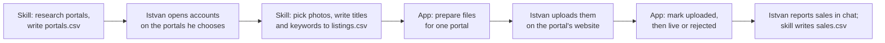

# Show My Best: selling photos

| | |
|---|---|
| Version | 0.1, draft for review |
| Date | 2026-09-16 |
| Owner | Istvan Csenkey-Sinko |
| Extends | [requirements-spec.md](requirements-spec.md). Everything there still applies unless this document says otherwise. |

## 1. Purpose

Istvan wants his photos to earn money as well as enter competitions. A second Claude skill,
`photo-sales-curator`, researches where photos can be sold, picks the photos worth
selling, and writes titles, descriptions and keywords for each portal. Show My Best shows
that work, prepares the files for each portal, and lets Istvan track each upload.

The skill and the app still never talk to each other directly. They share three more CSV
files in the library folder.

## 2. Decisions

| # | Decision | Source |
|---|----------|--------|
| S1 | All three ways of selling are in scope: stock licensing, fine-art prints (print-on-demand and curated galleries) and limited editions. The skill recommends which portals fit his work instead of assuming. | Istvan, 2026-09-16 |
| S2 | The app prepares and Istvan uploads. The app exports ready-to-upload files with the metadata embedded and opens the portal's upload page. It never logs in, never uploads and never stores a password. | Istvan, 2026-09-16 |
| S3 | A photo Istvan has entered in a competition, or that is matched to a competition that is still open, cannot be prepared or marked uploaded for any portal. The hold lifts by itself once the result is recorded, or once the competition closes without an entry. | Istvan, 2026-09-16 |
| S4 | Istvan has no portal accounts yet. The skill recommends where to open one, and he opens it himself. | Istvan, 2026-09-16 |
| S5 | The app may write the upload state of a listing: `status` and the date columns that go with it in `listings.csv`. This is a narrow exception to D19 ("the app writes only ratings"), because only Istvan knows the moment he uploaded. It follows the same safety rules as rating writes. | Proposed |
| S6 | Exported files go to `~/Pictures/Show My Best Exports/<portal_id>/`, outside the library. The library stays unchanged (NFR-3) and the skill never mistakes an export folder for a shoot. | Proposed |
| S7 | A photo sold as a limited edition is never also sold as an open print or licensed as stock, and the reverse. Open prints and cheap licences undermine the price of an edition. A photo on an exclusive portal is not offered anywhere else. | Proposed |
| S8 | Only photos Istvan has rated are proposed for sale. The independent-opinion rules still apply: a listing's reason is Claude's judgement, and the app shows listings for unrated photos only as a count (as IND-4 does). | Follows D14 |

## 3. App requirements

### 3.1 The Sales view

| ID | Requirement | Priority |
|----|-------------|----------|
| SAL-1 | A Sales view sits next to Competitions and Submissions. It has four parts: Upload queue, Listed, Portals and Earnings. | Must |
| SAL-2 | If none of `portals.csv`, `listings.csv` or `sales.csv` exists, the view explains that the skill writes them, and what to ask Claude. | Must |
| SAL-3 | Listings for photos Istvan has not rated are left out of every list and shown only as a count (S8). | Must |

### 3.2 Upload queue

| ID | Requirement | Priority |
|----|-------------|----------|
| SAL-4 | The upload queue shows listings with status `suggested` or `prepared`, grouped by portal. Portals where Istvan has an active account come first. | Must |
| SAL-5 | Each portal group shows the portal's name, kind, account status, and its file requirements: minimum megapixels, longest edge, maximum keywords and title length. If there is no account yet, it links to the sign-up page instead. | Must |
| SAL-6 | Each listing shows the photo thumbnail, listing type, title, description, keywords with a count, status, and any hold or problem. The thumbnail opens the photo detail. | Must |
| SAL-7 | "Prepare files" exports every listing in the group that has no hold and no blocking problem. The listings not exported are named, each with its reason. | Must |
| SAL-8 | Title, description and keywords can each be copied to the clipboard with one click, for portals whose upload form has to be filled in by hand. | Must |
| SAL-9 | "Open upload page" opens the portal's `upload_url` in the default browser and shows the export folder in Finder. | Must |
| SAL-10 | "Mark uploaded" is available on a prepared listing without a hold, and on all prepared listings in a group at once. | Must |

### 3.3 Listed

| ID | Requirement | Priority |
|----|-------------|----------|
| SAL-11 | Listed shows listings with status `uploaded`, `live`, `rejected` or `withdrawn`, grouped by status, each with its portal and dates. | Must |
| SAL-12 | An uploaded listing can be marked live or rejected. A live one can be marked withdrawn. A rejected one can be put back in the queue as `suggested`, so the skill can revise it. | Must |

### 3.4 Portals and earnings

| ID | Requirement | Priority |
|----|-------------|----------|
| SAL-13 | Portals lists every portal in `portals.csv` with kind, account status, the skill's call and its reasoning, commission, payout, exclusivity, file requirements, film-scan and editorial acceptance, and terms flag and notes. It links to the website, sign-up page and upload page. | Must |
| SAL-14 | A `caution` or `rights-grab` terms flag is as prominent as a competition's rights flag (CMP-4). | Must |
| SAL-15 | A portal whose `last_checked` is more than 30 days old says its terms may have changed. | Should |
| SAL-16 | Earnings shows total sales per currency, sales per portal, each limited edition with how many of its prints are sold, and the list of sales newest first. | Must |

### 3.5 Holds and problems

A **hold** stops a listing from being prepared or marked uploaded. A **problem** with a
file stops it from being prepared. A **warning** is only shown. They are worked out
every time the data loads and are never stored, so they appear and lift by themselves.

| ID | Requirement | Priority |
|----|-------------|----------|
| SAL-17 | Hold: the photo is in a submission whose result is `pending` ("Entered in X, waiting for results"). | Must |
| SAL-18 | Hold: the photo is matched to a competition that is not closed ("Matched to X, closes on DATE"). | Must |
| SAL-19 | Hold (S7): a stock, editorial or print listing for a photo that has an edition listing prepared, uploaded or live, and the reverse. | Must |
| SAL-20 | Hold (S7): any listing for a photo uploaded or live on another portal whose `exclusivity` is `exclusive`, and a listing on an exclusive portal for a photo uploaded or live anywhere else. | Must |
| SAL-21 | Problem: the photo file is missing, or is smaller than the portal's `min_megapixels`. | Must |
| SAL-22 | Warning: more keywords than `max_keywords`, or a title longer than `max_title_chars`. The app does not cut them, because shortening them is the skill's job. | Should |
| SAL-23 | Warning: the photo won or placed in a competition flagged `caution` or `rights-grab` ("Check what X may do with winning entries"). | Should |
| SAL-24 | In the competitions view, a matched photo that is uploaded or live on a portal is marked "For sale on X" when the competition's `previously_unpublished` rule is `yes` or `unknown`. | Must |
| SAL-25 | The photo detail lists the photo's listings with portal, type, status and reason, and its holds, once Istvan has rated it. | Should |

### 3.6 Preparing files

| ID | Requirement | Priority |
|----|-------------|----------|
| SAL-26 | Files are written to `~/Pictures/Show My Best Exports/<portal_id>/` (S6). The photo in the library is only read (NFR-3). | Must |
| SAL-27 | Each file is a JPEG in sRGB at quality 95, upright, no larger than the portal's `max_long_edge_px` and never enlarged. | Must |
| SAL-28 | Title, description, keywords, creator and copyright notice are embedded as IPTC and XMP metadata, which stock portals read on upload. Camera EXIF data is kept and GPS location is removed. | Must |
| SAL-29 | A file is named after the original (`IMG_0412.jpg`). If two listings for the same portal share a name, both get their shoot name added (`IMG_2216-R8_Rovinj_202606.jpg`). | Must |
| SAL-30 | The portal folder also gets `metadata.csv` (filename, title, description, keywords, category, listing type) covering every prepared listing for that portal, for portals that accept a metadata file. | Should |
| SAL-31 | Once the files are written, the listings become `prepared` with `prepared_on` set. | Must |

### 3.7 Writing listing status

| ID | Requirement | Priority |
|----|-------------|----------|
| SAL-32 | The app changes only `status`, `prepared_on`, `uploaded_on`, `live_on` and `ended_on` in `listings.csv`, and adds any of those date columns that are missing at the end. | Must |
| SAL-33 | Every write re-reads the file first, finds rows by `portal_id` + `source_folder` + `filename`, changes only those cells, and replaces the file in one step (RAT-4 to RAT-7). | Must |
| SAL-34 | Before the first write of the day, `listings.csv` is copied to the app's backups folder (RAT-10). | Must |
| SAL-35 | If the file cannot be read or written, nothing changes and a message names the file and the reason. | Must |

### 3.8 Network and privacy

| ID | Requirement | Priority |
|----|-------------|----------|
| SAL-36 | NFR-2 still holds. The app opens portal pages in the browser only when Istvan clicks, and never connects to a portal itself. | Must |
| SAL-37 | The app never asks for, stores or fills in portal passwords (S2). | Must |

## 4. Data contract

The rules in section 6.1 of the requirements (FMT-1 to FMT-10) apply to all three files.

### 4.1 `portals.csv`

One row per portal the skill has researched.

| Column | Content | Required |
|--------|---------|----------|
| `portal_id` | Lowercase words joined by hyphens, for example `adobe-stock`. Unique. | Yes |
| `name` | Portal name. | Yes |
| `kind` | `stock`, `print-on-demand`, `gallery` or `own-shop`. | Yes |
| `url` | Home or contributor page. | Yes |
| `signup_url` | Where a contributor account is opened. | |
| `upload_url` | Where files are uploaded. | |
| `account_status` | `none`, `applied`, `active`, `rejected` or `closed`. Set by the skill when Istvan says so. | Yes |
| `exclusivity` | `non-exclusive` or `exclusive`. | Yes |
| `commission` | What Istvan earns per sale, as the portal states it. | |
| `payout` | Minimum payout and method, for example PayPal and its threshold. | |
| `min_megapixels` | Number. | |
| `max_long_edge_px` | Number. Empty means full size. | |
| `max_keywords` | Number. | |
| `max_title_chars` | Number. | |
| `editorial` | `yes` if the portal accepts editorial content (recognisable people or brands without a release), else `no`. | |
| `film_scans` | `yes`, `no` or `unknown`. | |
| `terms_flag` | `ok`, `caution` or `rights-grab`. Covers exclusivity traps, licensing contributors' work for AI training, and perpetual rights. | Yes |
| `terms_notes` | What the terms claim. | |
| `recommendation_call` | `join`, `later` or `skip`. | Yes |
| `reasoning` | Why, about the portal only: fit with his genres, commission, volume, terms. Never about a specific photo. | |
| `last_checked` | Date the skill last verified the details online. | Yes |

### 4.2 `listings.csv`

One row per photo offered on a portal. `portal_id` + `source_folder` + `filename` is unique.

| Column | Content | Written by | Required |
|--------|---------|------------|----------|
| `portal_id` | Refers to `portals.csv`. | Skill | Yes |
| `source_folder` | Shoot folder of the photo. | Skill | Yes |
| `filename` | Filename of the photo. | Skill | Yes |
| `listing_type` | `stock` (commercial licence), `editorial`, `print` or `edition`. | Skill | Yes |
| `title` | Title for this portal. English. | Skill | |
| `description` | Description or caption for this portal. | Skill | |
| `keywords` | Keywords separated by `;`, most important first. | Skill | |
| `category` | The portal's category. | Skill | |
| `price` | Number, for prints and editions. | Skill | |
| `currency` | ISO 4217 code. | Skill | |
| `edition_size` | Number of prints in the edition, for `edition`. | Skill | |
| `print_sizes` | Sizes offered, separated by `;`. | Skill | |
| `reason` | Why this photo suits this portal. Claude's judgement: the app hides it for unrated photos. | Skill | |
| `status` | `suggested`, `prepared`, `uploaded`, `live`, `rejected` or `withdrawn`. | Skill; app (S5) | Yes |
| `suggested_on` | Date the skill proposed it. | Skill | |
| `prepared_on` | Date the files were prepared. | App | |
| `uploaded_on` | Date Istvan marked it uploaded. | App; skill when told | |
| `live_on` | Date it was accepted. | App; skill when told | |
| `ended_on` | Date it was rejected or withdrawn. | App; skill when told | |
| `portal_ref` | The portal's ID or link for the item once live. | Skill | |
| `notes` | Free text, for example the reason for a rejection. | Skill | |

### 4.3 `sales.csv`

One row per sale Istvan reports. Written only by the skill.

| Column | Content | Required |
|--------|---------|----------|
| `date` | Date of the sale. | Yes |
| `portal_id` | Refers to `portals.csv`. | Yes |
| `source_folder` | Shoot folder of the photo. | Yes |
| `filename` | Filename of the photo. | Yes |
| `listing_type` | As in `listings.csv`. | |
| `edition_number` | For an edition, which print was sold. | |
| `amount` | What Istvan earned, as a number. | Yes |
| `currency` | ISO 4217 code. | Yes |
| `notes` | Free text, for example the licence or print size. | |

## 5. Skill requirements (`photo-sales-curator`)

| ID | Requirement | Priority |
|----|-------------|----------|
| SSK-1 | Researches portals live each time: kind, commission, payout from Hungary, exclusivity, file requirements, whether film scans and editorial are accepted, and terms (including AI-training licences). Writes `portals.csv` and sets `last_checked`. Nothing is taken from memory as fact. | Must |
| SSK-2 | Recommends a small starting set, with `join`, `later` or `skip` and the reasoning, so Istvan opens few accounts and learns from them. | Must |
| SSK-3 | Gets its candidates from `scripts/sales-candidates.py`, which lists rated photos and leaves out photos with a hold (SAL-17 to SAL-20). | Must |
| SSK-4 | Judges sellability separately from competition strength: stock rewards a clear subject, clean technique at full size, room for copy and a searchable subject; prints and editions reward the photos Istvan rates highest. Editions only for photos Istvan rated 5, or rated 4 when Claude also rated 4 or 5. | Must |
| SSK-5 | Anything with recognisable people, private property, logos or artworks is `editorial` unless Istvan confirms he has a release, and goes only to portals with `editorial` = `yes`. | Must |
| SSK-6 | Writes titles, descriptions and keywords in English, within the portal's limits, and without trademarks, camera brands or claims the photo does not show. | Must |
| SSK-7 | Follows the section 6.1 writing rules, re-reads `listings.csv` before every write, and never sets `status` or the date columns back to an earlier stage than the file shows, because the app writes them too. | Must |
| SSK-8 | Records `account_status`, rejections with their reasons, and sales only when Istvan reports them. | Must |
| SSK-9 | Treats a rejection as feedback: records the reason in `notes` and uses it for later listings on that portal. | Should |
| SSK-10 | Gives no tax or legal advice beyond pointing to the portal's own tax forms and contributor terms. | Must |

The `photo-competition-curator` skill also checks `listings.csv`: a photo uploaded or live
on a portal counts as published for `previously_unpublished` rules, and one on an exclusive
portal is not matched at all.

## 6. Acceptance scenarios

| ID | Scenario | Checks |
|----|----------|--------|
| SAC-1 | **Hold while entered.** A photo has a stock listing and a pending submission. | The listing shows "Entered in X, waiting for results", and it can't be prepared or marked uploaded. When the result becomes `no-award`, the hold is gone after reload. SAL-17. |
| SAC-2 | **Prepare for a portal.** Three listings for `adobe-stock`; one photo is 3 MP against `min_megapixels` 4. | Two files in `~/Pictures/Show My Best Exports/adobe-stock/`, sRGB JPEG, keywords readable in the file's IPTC data. The third is named with its reason. Both listings are `prepared` with today's date. No file in the library changed. SAL-7, SAL-21, SAL-26 to SAL-31. |
| SAC-3 | **Status write keeps the file.** Istvan marks a listing uploaded. | Only `status` and `uploaded_on` of that row change; all other bytes are identical. SAL-32, SAL-33. |
| SAC-4 | **Edition and stock.** A photo has a live `edition` listing and a suggested `stock` listing. | The stock listing is held. SAL-19. |
| SAC-5 | **Unrated photo.** A listing exists for a photo Istvan has not rated. | It appears only as a count. SAL-3. |
| SAC-6 | **Published photo in a competition.** A live listing, and a match to a competition with `previously_unpublished` = `yes`. | The competitions view marks the photo "For sale on X". SAL-24. |
